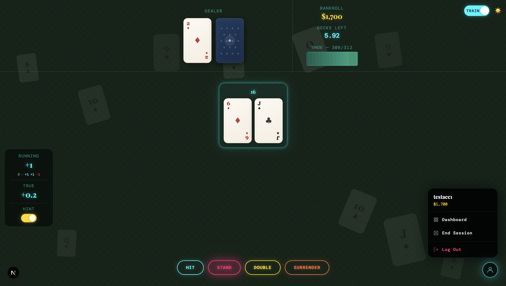
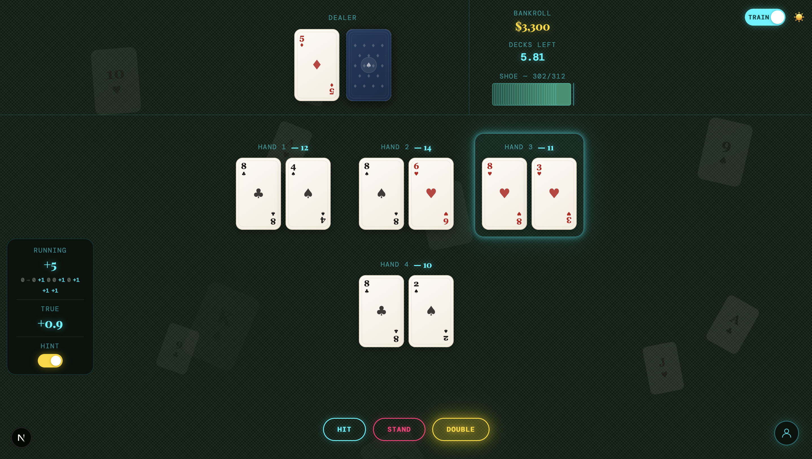
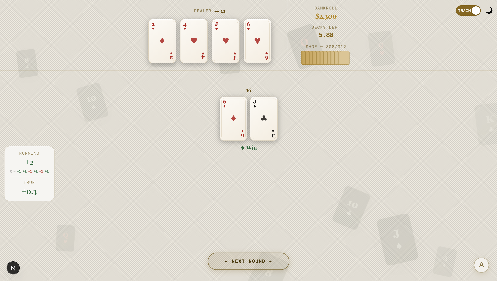
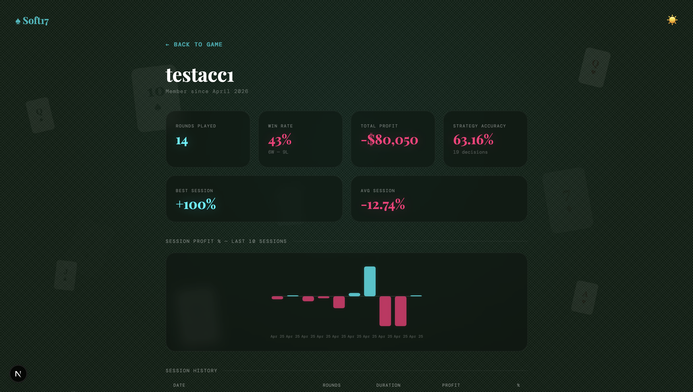

# ♠ Soft17 — Blackjack Card Counting Trainer

A production-ready blackjack trainer built to help players master Hi-Lo card counting and basic strategy. Soft17 features a full blackjack engine, real-time count tracking, session persistence, and a stats dashboard — all wrapped in a polished, responsive UI.






---

## Features

### Blackjack Engine
- Full rule set: hit, stand, double down, split (up to 4 hands), surrender, insurance
- Soft 17 dealer rules
- 6-deck shoe with realistic penetration
- Animated card dealing with flying card transitions

### Card Counting
- Hi-Lo counting system with real-time running and true count
- Count history trail showing each card's contribution
- True count derived from running count ÷ decks remaining
- Count persists across sessions — restored exactly from the database on resume

### Train Mode
- Toggle hint system that highlights the basic strategy recommendation per hand
- Strategy accuracy tracking — measures decisions made without the hint
- Per-session and lifetime accuracy stats

### Session Management
- Full session lifecycle: create, resume, end
- Shoe state and running count saved to the database on every round
- Resume a session days later and pick up exactly where you left off
- Mid-round interrupts (refresh, navigate away) restore cleanly to pre-round state

### Dashboard
- Lifetime stats: rounds played, win rate, total profit, strategy accuracy, best/avg session
- Per-session bar chart showing profit % over recent sessions
- Live current session panel with real-time profit
- Paginated session history table with duration, rounds, and profit

### Auth & Profiles
- Email/password auth via Supabase
- Guest mode with localStorage bankroll persistence
- Dynamic chip denominations that scale with bankroll (from $5/$10/$25 to $50K/$100K/$500K)
- Dark / light theme

---

## Tech Stack

| Layer | Technology |
|---|---|
| Framework | Next.js 15 (App Router) |
| Language | TypeScript |
| Styling | Tailwind CSS v4 |
| Animations | Framer Motion |
| State | Zustand |
| Backend | Supabase (Auth + PostgreSQL) |
| Fonts | Playfair Display, DM Mono |

---

## Architecture Highlights

**Shoe + Count Persistence** — On every `roundOver`, the full shoe array (JSONB) and running count are written to `session_stats`. On resume, they're fetched and hydrated back into the game engine and count store, with true count recalculated from the restored state.

**Session Gate Flow** — A `SessionGate` component handles all session transitions: new session creation, resume, end, and the "are you sure?" confirmation when ending mid-game. Each path correctly resets or restores shoe/count state depending on context.

**Strategy Accuracy Tracking** — The game tracks every action taken without the hint visible (`hintUsed` flag in Zustand). Correct vs. total hint-off decisions are aggregated into lifetime and session stats, giving a true measure of basic strategy mastery.

**Dynamic Chip Scaling** — Chip denominations are computed from the player's current bankroll tier, so the betting interface always makes sense whether you're playing with $100 or $1,000,000.

---

## Database Schema

```sql
profiles
  user_id        uuid  FK → auth.users (CASCADE)
  username       text  UNIQUE
  bankroll       int
  created_at     timestamptz

lifetime_stats
  user_id              uuid  FK → auth.users (CASCADE)
  hands_played         int
  hands_won            int
  hands_lost           int
  strategy_accuracy    numeric
  hint_off_decisions   int
  hint_off_correct     int
  best_session_profit_percent  numeric
  avg_session_profit_percent   numeric

session_stats
  id                uuid  PK
  user_id           uuid  FK → auth.users (CASCADE)
  starting_bankroll int
  ending_bankroll   int
  net_profit        numeric
  profit_percent    numeric
  hands_played      int
  hands_won         int
  started_at        timestamptz
  ended_at          timestamptz
  shoe              jsonb   -- full deck state
  running_count     int
```

---

## Getting Started

### Prerequisites
- Node.js 20+
- A Supabase project

### Setup

```bash
git clone https://github.com/mLeo19/blackjack-counting.git
cd blackjack-counting
npm install
```

Create a `.env.local` file:

```env
NEXT_PUBLIC_SUPABASE_URL=your_supabase_url
NEXT_PUBLIC_SUPABASE_ANON_KEY=your_supabase_anon_key
```

Run the database migrations in your Supabase SQL editor (schema above), then:

```bash
npm run dev
```

---

## Project Structure

```
app/
  page.tsx              Landing page
  game/
    page.tsx            Main game UI + session orchestration
    SessionGate.tsx     Session lifecycle management
  login/page.tsx
  signup/page.tsx
  dashboard/page.tsx
components/
  game/                 Card, FlyingCard, BetControls, CountOverlay,
                        ActionButton, TrainToggle, AvatarMenu, GameToast...
  dashboard/            StatCard, BarChart, formatDuration
  ui/                   FloatingCards, PageLayout
hooks/
  useGameController.ts  Core game loop
  useProfile.ts         Auth + profile loading
store/
  countStore.ts         Hi-Lo count state (Zustand)
lib/
  blackjack/            deck, hand, dealer, engine
  counting/             hiLo, basicStrategy
  supabase/             client, server, profile helpers
```

---

## Screenshots

> Dark mode game view, count overlay, split hands, dashboard stats

---

## License

MIT
